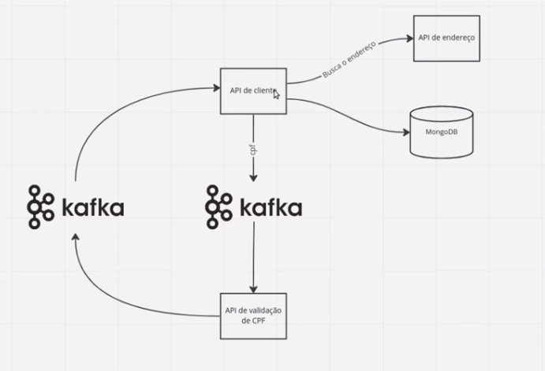

# Arquitetura Hexagonal / Ports and Adapters

### Technologies
For further reference, please consider the following technologies:

* spring-web
* spring-validation
* spring-cloud-starter-openfeign
* kafka-streams
* spring-data-mongodb
* mapstruct
* mapstruct-processor

### Flow
The following image illustrate how is the flow of the application:

A **API de client** buscará um endereço por meio do cep na **API de endereço** (mock) e salva esse endereço no **mongodb**.

Depois o cpf é enviado para uma fila do **Kafka**. A **API de validação** vai consumir a fila do **Kafka** validar cpf e as 
informações do cliente e devolver essas informações para uma outra fila do **Kafka**. A **API de client** terá um consumidor para
essa fila e salvará na base de dados as alterações do usuário.

### Organization - structure
These additional references should also help you - straight to the point:

* **application** - core da aplicação, regra de negócio, isolado, livre de frameworks
* **application.core.domain** - classes de domínio
* **application.core.usecase** - regras de negócio
* **application.ports** - interfaces
* **application.ports.in** - portas(interfaces) de entrada para acessar o core
* **application.ports.out** - portas(interfaces) de saída do core

* **adapters** - implementações das portas de entradas e saída
* **adapters.in** - como entro na aplicação, seja pelo controller, seja por uma fila
* **adapters.in.controller** - controlador
* **adapters.in.consumer** - consumidor do kafka
* **adapters.out** - como saio da aplicação, seja para acessar uma base de dados, request em outro microserviço, ou para produzir mensagem em uma fila
* **adapters.out.client** - consulta a api externa
* **adapters.out.repository** - operações no db

* **config** - configurações do projeto 

### How to test

#### Load Wiremock
* **Wiremock :** java -jar wiremock-jre8-standalone-2.35.0.jar --port 8082
* **Files :** address.json and address_2.json
* **Route address wiremock :** http://localhost:8082/addresses/38400000

#### IntelliJ and Offset Explorer
* **Kafka plugin** - kafkalytics Intellij
* **Topics** - create topics: tp-cpf-validation and tp-cpf-validated
* **Tool** - Offset Explorer 2.0 (see submissions by topics)

#### Load Kafka and Mongodb
* **Docker :** docker-compose up